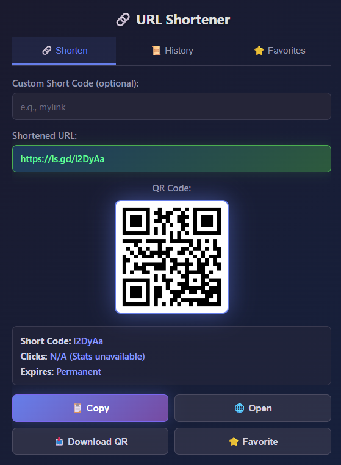
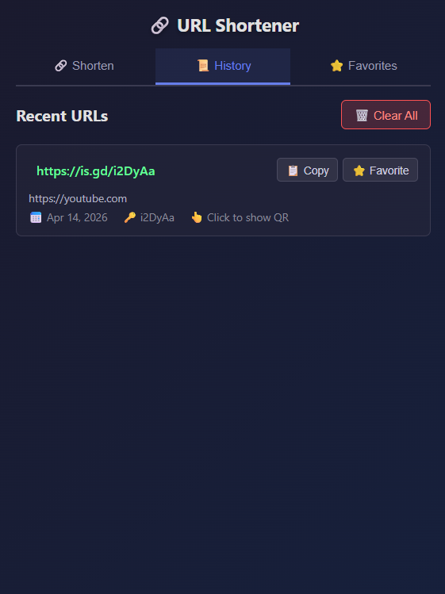
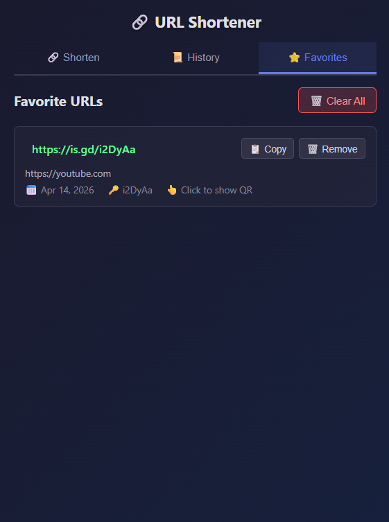

# URL Shortener

Chrome extension for shortening the current tab URL with `is.gd`, generating a QR code, and saving links into history and favorites.


## Features

- Shorten the active tab URL in one click
- Generate a QR code for each shortened link
- Copy and open shortened URLs quickly
- Save recent links in history
- Add important links to favorites
- Download QR codes as PNG files
- Create custom short codes when available

## Screenshots

### Shorten



### History



### Favorites



## Installation

1. Clone the repository:

```bash
git clone https://github.com/emi-ran/url-shortener.git
cd url-shortener
```

2. Open `chrome://extensions/` in Chrome.
3. Enable `Developer mode`.
4. Click `Load unpacked`.
5. Select the project root folder.

## Usage

1. Open any page in Chrome.
2. Click the extension icon.
3. The extension shortens the current tab URL automatically.
4. Use the `Shorten`, `History`, and `Favorites` tabs as needed.

## Tech Stack

- Chrome Extension Manifest V3
- Vanilla JavaScript
- Vanilla CSS
- `is.gd` API
- QR Server API

## Project Structure

```text
url-shortener/
|-- assets/
|   |-- icons/
|   |   `-- icon.png
|   `-- screenshots/
|       |-- favorites.png
|       |-- history.png
|       `-- shorten.png
|-- src/
|   `-- popup/
|       |-- api.js
|       |-- dom.js
|       |-- main.js
|       |-- popup.css
|       |-- popup.html
|       `-- storage.js
|-- .gitignore
|-- manifest.json
`-- README.md
```

## Configuration

This extension uses:

- URL shortening: [is.gd](https://is.gd/)
- QR generation: [QR Server](https://goqr.me/api/)

No API key is required.

## Development

There is no build step in this project.

1. Edit the source files under `src/`.
2. Reload the unpacked extension in Chrome.
3. Test the popup flows.

## Notes

- `manifest.json` stays in the project root because Chrome expects the extension manifest at the root.
- Source files are now grouped under `src/`, with popup logic split into smaller modules, and static assets under `assets/`.
